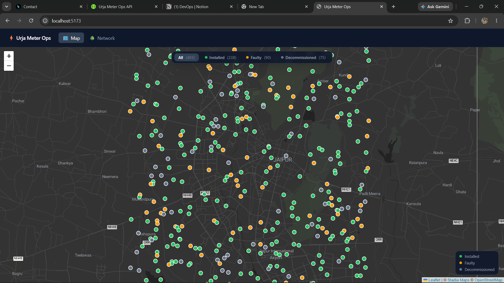
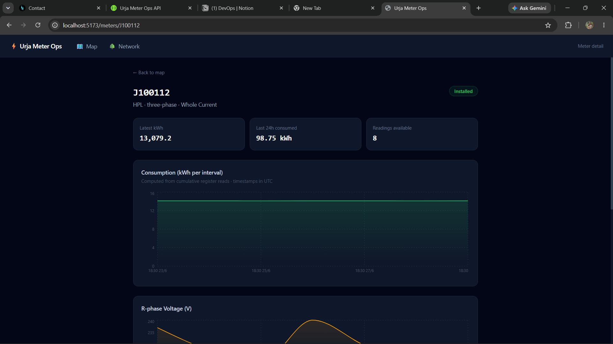
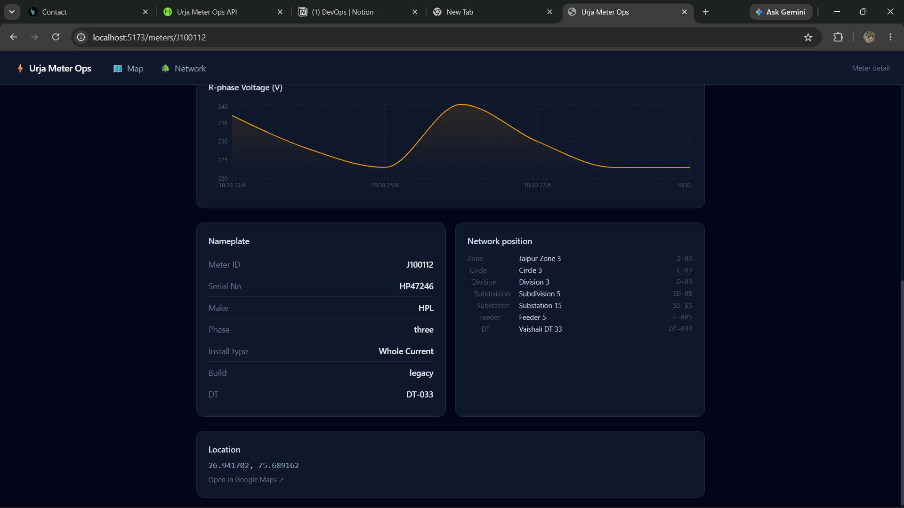
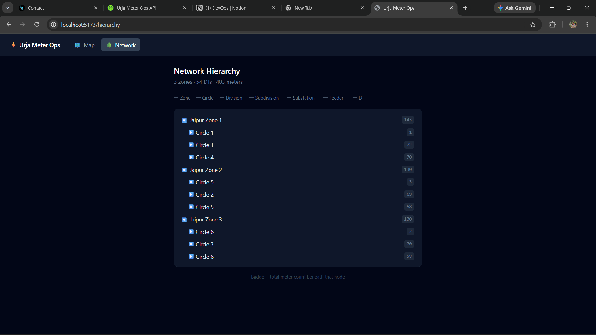

# Urja Meter Ops API

A clean REST API and web client built over the **Urja Meter Ops** legacy web portal for the Flock Energy engineering take-home assignment.

The portal has no public API — this service reverse-engineered its internal browser-to-server communication, then wraps it in a well-structured, documented API and a modern web client that any engineer or operations team can use without ever touching the original portal.

---

## What Was Built

### API — `src/` (NestJS + TypeScript)

| Route | Description |
|---|---|
| `GET /api/v1/meters` | Paginated meter list with free-text search |
| `GET /api/v1/meters/:id` | Full meter detail — nameplate, 7-level network hierarchy, GPS |
| `GET /api/v1/meters/:id/consumption` | Energy readings (kWh, kVAh, voltage), timestamps normalised to UTC ISO 8601 |
| `GET /api/v1/transformers` | Paginated distribution transformer (DT) list |
| `GET /api/v1/network/hierarchy` | Full hierarchy tree (Zone → Circle → Division → Subdivision → Substation → Feeder → DT) with meter counts |
| `GET /api/v1/network/export` | All 403 meters in one response — full hierarchy + geo, for bulk ingestion |

**Swagger UI** is served at `http://localhost:3000/docs`. `openapi.json` is written to the project root on startup.

### Web Client — `client/` (React + Vite + Tailwind)

A single-page app with three views, all talking directly to the API above:

---

**Map view** (`/`) — 403 meters on a live dark map, colour-coded by status



- Pins colour-coded by status: green = Installed, amber = Faulty, slate = Decommissioned
- Filter bar at the top toggles visibility by status with live counts
- Click any pin → summary card slides up with meter ID, make, phase, status, hierarchy path
- "View detail →" navigates to the meter detail view

---

**Meter detail view** (`/meters/:id`) — consumption charts, nameplate, network position





- Stats row: latest cumulative kWh, last-24h consumption (computed from register deltas), reading count
- Consumption area chart — kWh per half-hour interval derived from cumulative register reads
- R-phase voltage area chart over the same time window
- Nameplate table: make, serial, phase, install type, build generation (`legacy` / `v2`)
- Network position — indented 7-level hierarchy with codes
- GPS coordinates with a Google Maps link

---

**Network hierarchy view** (`/hierarchy`) — fully collapsible 7-level tree



- Zones → Circles → Divisions → Subdivisions → Substations → Feeders → DTs
- Every node shows total meter count beneath it as a badge
- Starts with zones expanded; click any node to drill down or collapse

---

## Project Structure

```
flock-energy-api/
├── src/                              # NestJS API
│   ├── main.ts                       # Bootstrap, OpenAPI config, writes openapi.json
│   ├── app.module.ts
│   ├── portal-client/
│   │   ├── portal-client.module.ts   # @Global — injected into all feature modules
│   │   └── portal-client.service.ts  # All portal HTTP: login, session, HMAC, re-auth
│   ├── meters/
│   ├── transformers/
│   ├── consumption/
│   ├── network/
│   └── common/
│       ├── dto/pagination.dto.ts
│       └── filters/http-exception.filter.ts
│
├── client/                           # React web client
│   ├── src/
│   │   ├── api.ts                    # Typed wrapper over the NestJS API
│   │   ├── App.tsx                   # Router + nav bar
│   │   └── pages/
│   │       ├── MapPage.tsx           # Leaflet map with status filters
│   │       ├── MeterPage.tsx         # Detail + Recharts consumption/voltage charts
│   │       └── HierarchyPage.tsx     # Collapsible hierarchy tree
│   └── vite.config.ts                # Proxies /api → localhost:3000
│
├── test/                             # Unit tests (29 tests, 4 files)
├── PROTOCOL.md                       # How the portal actually works
├── REFLECTION.md                     # Reflection questions
├── openapi.json                      # Generated OpenAPI 3.x spec
└── .env.example
```

**Key design principle:** all portal-specific logic — HTTP, authentication, session cookie management, HMAC signing — lives exclusively in `PortalClientService`. Feature modules call two methods: `portal.get(path)` and `portal.getExport()`. They never see cookies, status codes, or auth headers.

---

## Setup & Installation

**Prerequisites:** Node.js 18+ and npm.

```bash
# 1. Clone the repository
git clone <repo-url>
cd flock-energy-api

# 2. Install API dependencies
npm install

# 3. Configure environment
cp .env.example .env
# Edit .env if needed — defaults match the provided credentials

# 4. Install client dependencies
cd client && npm install && cd ..
```

`.env.example`:
```
PORTAL_BASE_URL=https://urja-ops.flockenergy.tech
PORTAL_EMAIL=operator@urja.local
PORTAL_PASSWORD=urja-ops-2026
PORT=3000
```

---

## Running

### API only

```bash
npm run start:dev        # development (ts-node, no compile step)

npm run build && npm start  # production
```

On startup the service:
1. Logs in to the portal and establishes a session
2. Fetches the HMAC signing secret
3. Starts listening on port 3000 (or `$PORT`)
4. Writes `openapi.json` to the project root

```
┌─────────────────────────────────────────────────────┐
│  Urja Meter Ops API                                 │
│  Base URL   : http://localhost:3000/api/v1          │
│  Swagger UI : http://localhost:3000/docs            │
│  OpenAPI    : openapi.json (written to project root)│
└─────────────────────────────────────────────────────┘
```

### API + Web client

```bash
# Terminal 1 — start the API
npm run start:dev

# Terminal 2 — start the client
cd client
npm run dev
```

Open **http://localhost:5173**

The Vite dev server proxies `/api/*` to `localhost:3000` — no CORS configuration needed.

---

## Running Tests

```bash
npm test
```

29 unit tests across 4 files. All tests mock `PortalClientService` or its underlying axios instance — no real network calls are made.

| File | What it tests |
|---|---|
| `portal-client.service.spec.ts` | Login flow, session cookie, 401 retry, HMAC signing, 404 flag |
| `meters.service.spec.ts` | List pagination, findOne detail, NotFoundException on bad ID |
| `consumption.service.spec.ts` | Timestamp UTC conversion, delta parsing, null handling, sort order |
| `network.service.spec.ts` | Hierarchy tree construction, deduplication, sorting, multi-zone |

---

## Sample API Requests

### List meters (paginated)
```bash
curl "http://localhost:3000/api/v1/meters?page=1&limit=5"
```
```json
{
  "data": [
    {
      "meterId": "J100000",
      "serialNo": "SE33962",
      "make": "HPL",
      "phaseType": "single",
      "installStatus": "Decommissioned",
      "dtCode": "DT-001"
    }
  ],
  "total": 403,
  "page": 1,
  "limit": 5,
  "totalPages": 81
}
```

### Search meters
```bash
curl "http://localhost:3000/api/v1/meters?q=J1004"
```

### Meter detail (nameplate + hierarchy + geo)
```bash
curl "http://localhost:3000/api/v1/meters/J100004"
```
```json
{
  "meterId": "J100004",
  "serialNo": "SE65293",
  "make": "Genus",
  "phaseType": "single",
  "installStatus": "Faulty",
  "installType": "CT Operated",
  "build": "v2",
  "dtCode": "DT-005",
  "hierarchy": {
    "zone":        { "name": "Jaipur Zone 2",  "code": "Z-02" },
    "circle":      { "name": "Circle 5",        "code": "C-05" },
    "division":    { "name": "Division 5",      "code": "D-05" },
    "subdivision": { "name": "Subdivision 5",   "code": "SD-05" },
    "substation":  { "name": "Substation 5",    "code": "SS-05" },
    "feeder":      { "name": "Feeder 5",        "code": "F-005" },
    "dt":          { "name": "Bani Park DT 5",  "code": "DT-005" }
  },
  "geo": { "lat": 26.907, "lng": 75.725 }
}
```

### Consumption readings
```bash
curl "http://localhost:3000/api/v1/meters/J100000/consumption"
```
```json
{
  "meterId": "J100000",
  "count": 337,
  "readings": [
    { "timestamp": "2026-06-16T18:30:00.000Z", "kwh": 48100.5, "kvah": 51900.2, "voltR": 225 },
    { "timestamp": "2026-06-16T19:00:00.000Z", "kwh": 48101.8, "kvah": 51901.6, "voltR": 227 }
  ]
}
```

> `kwh` and `kvah` are **cumulative register values** — subtract consecutive readings to get interval consumption. The web client does this automatically for its charts.

### Network hierarchy
```bash
curl "http://localhost:3000/api/v1/network/hierarchy"
```

### Bulk export (all 403 meters)
```bash
curl "http://localhost:3000/api/v1/network/export"
```

---

## Assumptions

1. **Timezone.** Portal timestamps (`DD/MM/YYYY HH:mm`) carry no UTC offset. Based on geography (Jaipur, India) I assume IST (UTC+5:30) and convert to UTC ISO 8601. Documented in `PROTOCOL.md`.

2. **Cumulative readings.** The portal's `kwh`/`kvah` values are cumulative register reads, not interval deltas. The API exposes them as-is; the web client computes deltas for the consumption chart. Computing deltas server-side would require assumptions about meter resets that aren't safe without more context.

3. **Single process, single session.** The service holds one session in memory. Appropriate for a single-process proxy; horizontal scaling would move the session to Redis.

4. **Export pagination is effectively broken.** The portal's `/portal/export` returns all 403 meters regardless of the `page` param. I treat page 1 as canonical. Documented in `PROTOCOL.md`.

5. **Portal is the source of truth.** No local database. Every API request proxies live portal data.

---

## Design Decisions & Trade-offs

**PortalClientService as the sole portal boundary.** All HTTP, cookies, HMAC signing, and re-auth logic lives in one place. Feature modules never touch auth details — swapping or mocking the portal is a one-file change.

**Session in memory, not Redis.** Simple and correct for a single process. The `loginMutex` already serialises concurrent callers to avoid double-login races.

**Meter detail uses the bulk export.** The portal has no single-meter detail endpoint. Fetching all 403 meters and finding by ID is fast at this scale (<1 MB, ~150 ms). At 50 000+ meters this approach would need replacing with a local cache.

**No caching.** Omitted deliberately to keep the service correct and simple. The obvious first addition would be a 30–60 second TTL on `getExport()`.

**NestJS over plain Express.** Clean module boundaries, DI, and first-class OpenAPI generation via decorators — all worth it for a service that will be read and evaluated.

**Vite proxy for the client.** Avoids all CORS configuration during development. In production you'd put both behind a reverse proxy (nginx) or serve the built client as static files from the NestJS app.

---

## What Was Intentionally Skipped

- **Auth on our API.** Out of scope for this assignment. Bearer token auth would be the obvious next step.
- **Response caching.** Described above — first improvement I'd make.
- **Date-range filtering on consumption.** The portal always returns the same fixed window, so filtering without full history would be misleading.
- **DT detail endpoint.** The portal has no per-DT energy data. A `GET /transformers/:id` would only repeat what the list already returns.
- **Docker / containerisation.** Out of scope for a take-home.
- **Integration tests.** Unit tests mock the portal client. True integration tests against the live portal would be inherently fragile.

---

## What I'd Improve With More Time

1. **Cache the export.** A 60-second in-memory TTL on `getExport()` would make meter detail and hierarchy lookups feel instant.

2. **Local index for querying.** Seed SQLite from the bulk export on startup, refresh every N minutes. Enables filtering by status, make, zone, geo proximity — things the portal can't answer. At ~50 k meters, switch to Postgres with a proper full-text + spatial index.

3. **Consumption delta endpoint.** `GET /meters/:id/consumption/delta` returning kWh per half-hour slot. More immediately useful than raw cumulative values.

4. **Proactive session refresh.** A background job that re-logs in 5 minutes before expiry eliminates the latency spike on the first post-expiry request.

5. **Structured logging + request IDs.** Replace NestJS `Logger` with pino + request ID propagation so portal errors can be correlated back to the upstream call.

6. **Client search.** Add a search box to the map page that filters visible pins by meter ID, DT, or zone — without navigating away.

---

## Key Files

| File | Description |
|---|---|
| `PROTOCOL.md` | How the portal actually works — auth, endpoints, quirks |
| `REFLECTION.md` | Answers to the assignment reflection questions |
| `openapi.json` | Generated OpenAPI 3.x spec (also live at `/docs-json`) |
| `src/portal-client/portal-client.service.ts` | All portal-specific logic |
| `client/src/pages/MapPage.tsx` | Leaflet map with status filters |
| `client/src/pages/MeterPage.tsx` | Consumption charts + meter detail |
| `client/src/pages/HierarchyPage.tsx` | Collapsible hierarchy tree |
| `test/` | 29 unit tests across 4 files |

